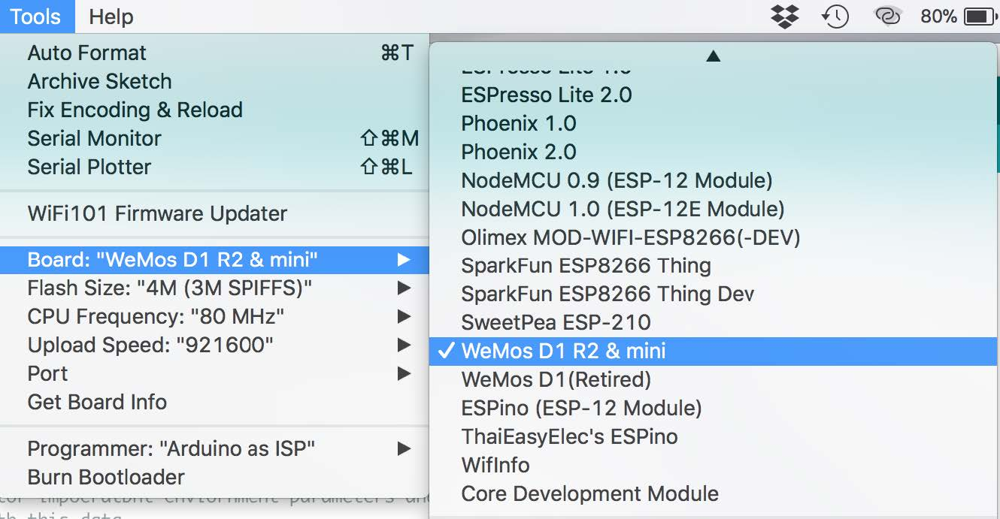
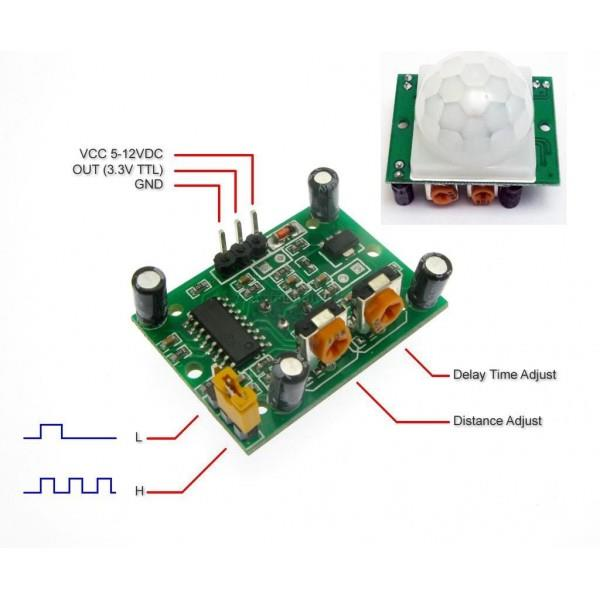
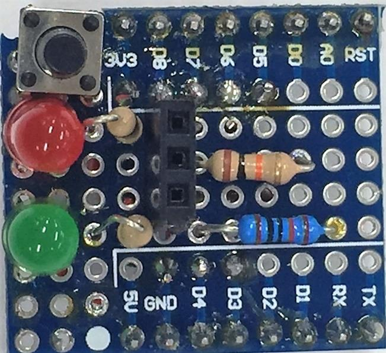
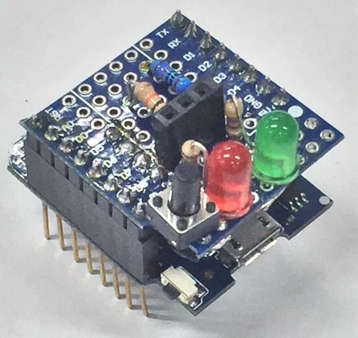
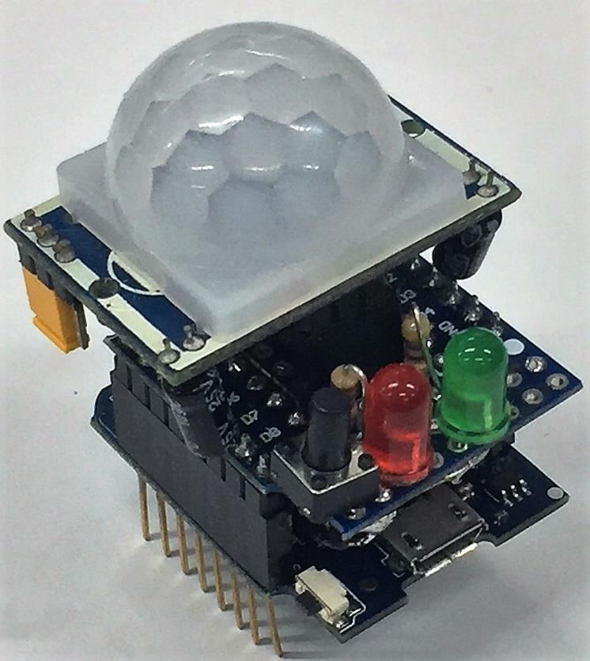

# Intruder Alert

The WiFi Intruder Alert provides you with email notifications and reports the exact time and date when someone has entered your monitored area, such as your room. The WiFi Intruder Alert is based on the ESP8266 integrated WiFi and Microcontroller unit. We used the ESP8266 D1 Mini main board, the small footprint measures only 25x35mm, making it ideal for hiding the unit away from the intruder’s view.


This project utilises the “G-Mail Email Sender Using ESP8266” project published in the Instructables community ([http://www.instructables.com/id/ESP8266-GMail-Sender](http://www.instructables.com/id/ESP8266-GMail-Sender) ). A few additional features have been added to enable date and time synchronisation using NTP (Network Time Protocol), and off course an interface to the PIR Motion sensor module.

## Before you start:

The ESp8266 provides internet connectivity and a 32bit Microcontroller with 4Mbyts of memory to host the embedded application code. The great thing about the ESP8266 microcontroller is that you can program it using your Arduino IDE, as if you were programming an Arduino MCU! All you need to do is make sure you download and install the ESP8266 hardware support in your Arduino IDE ( [http://www.instructables.com/id/How-to-Install-ESP8266-Into-Arduino-IDE/](http://www.instructables.com/id/How-to-Install-ESP8266-Into-Arduino-IDE/) ).



Because this project utilises the Gmail server, you need configure your Gmail “Sign-in & Security” options to allow less secure App, otherwise Gmail will not allow your Intruder Alert to send emails from your Gmail account.


## Components:

The components below are recommended for making the WiFi Intruder Alert, as it is presented in this project.

|Qty| Code | Description |
|---|---|---|
|1 | [XC3802](http://jaycar.com.au/p/XC3802) | ESP8266 module
|1 | [XC3850](http://jaycar.com.au/p/XC3850) | prototyping shield for ESP
|1 | [XC4444](http://jaycar.com.au/p/XC4444) | PIR motion sensor
|1 | [RR2766](http://jaycar.com.au/p/RR2766) | 1W 470 resistor
|1 | [RR0596](http://jaycar.com.au/p/RR0596) | 0.5W 10k resistor
|1 | [ZD0230](http://jaycar.com.au/p/ZD0230) | Red LED
|1 | [ZD0232](http://jaycar.com.au/p/ZD0232) | Green LED
|1 | [SP0601](http://jaycar.com.au/p/SP0601) | PCB mounted switch
|1 | [WH3025](http://jaycar.com.au/p/WH3025) | Hookup wire
|1 | [HM3230](http://jaycar.com.au/p/HM3230) | 40 pin female header strip

## Circuit & Assembly

We assembled the main components on the small Prototype board, everything fitted neatly on this board, though fitting all the wiring in a small space mostly at the bottom of the board looked like a spaghetti bowl, it all worked well. You are free to choose how you wish to assemble this project, as long as you adhere to the wiring connections detailed below:


When wiring LED’s remember the long pin is the Anode (+), and the shorter pin is the cathode (-).


Connecting the PIR Sensor is very easy simply connect the VCC pin to the 3.3v rail, and the GND to the same GND as the ESP8266 board. The PIR Sensor output pin is then connected to pin D5 of the ESP8266 board. We added a 10K ohm pull down resistor to make sure the PIR output signal is low at all times when no active motion is detected.

|Activity|PIR Out
|---|---
|No Motion|LOW
|Motion|HIGH



On the Prototype Shield (XC3850) we placed the main components, LED’s, Switch, and resistors. We also cut the 40 pin header to get the 3 pin socket where we will insert the PIR sensor. The wiring was mainly done on the back of the prototype shield, in accordance with the above circuit diagram.



The prototype shield is then inserted on-top of the ESP8266 main board (XC3802), as shown below., Make sure the pins are correctly aligned and match.



Now all you need to do is insert the PIR sensor pins in the allocated 3 pin header on the top of the prototype shield, as shown below.



## Application Code

First unzip the code file, you see three files, these files are to be located under the same directory in order for the code to compile.

|WiFi_Intruder_Alert.ino|This is the Arduino IDE source code file
|---|---
|Gsender.h|This is the header file needed to run the code. You will only ever need to update this file once, with your Gmail details.
|Gsender.cpp|This is the library code file. You will not need to modify this file.
## Modifying the Gsener.h file:

From the Arduino IDE open the WiFi_Intruder_Alert.ino file. You will notice three tabs on the tiop of the main editor scree, click on the Gsender.h to view this file. There are only three lines which need to be updated in this file, to tell the application your email address, and login details, as shown below:

```c
const char* EMAILBASE64_LOGIN = "am9lbm91cjY1QGstYWlsLmNvbQ==";
const char* EMAILBASE64_PASSWORD = "RzBkMTVMJHZlNGV2ZXI=";
const char* FROM = "your gmail address@gmail.com";
```

You will notice that the EMAILBASE64_LOGIN and EMAILBASE64_PASSWORD are encrypted, that is because you may not want to insert your private login details as plain text, so we use [base64encode.org](https://www.base64encode.org/)
to generate the encrypted version of our plain text email login credentials.

Once you have done this insert the encrypted string into the above code.

## Modifying the WiFi_Intruder_Alert.ino file:

In the main code file you need to configure your WiFi network SSID and password, as well as the destination email address where the notifications are to be sent to.

```c
#define to email "enter your email here"
cost char* ssid = "your WiFi SSID here"
cost char* password = "your WiFi password here"
```

Include the `""` in the above variables. Now all you need to do is download the code (as you would with any other Arduino development board).

## Tips & Tricks

The code has been written in a way that allows you to change the way the code works without too much hard coding. You can change the literal definitions to change the way the WiFi Intruder Alert works, here are some tips;

| Code | Advice |
|---|---
|#define longPRESS | This controls the hold time (in mSec) that a user needs to depress the switch before any action is taken. Hence a value of 500 means the user needs to depress the switch for at least 0.5 sec before the unit responds with an action; If the unit is OFF and the user presses the switch for a long_press, the unit will switch ON. If the unit is ON and the user presses the switch for a long_press, the unit will switch OFF.
|#define timezone|This is set to Sydney time zone by default (GMT + 10). You can change the time zone to your city. Note: If Day Light Savings time applies, then add (or remove) one to your city time zone, e.g. Sydney GMT+10 + 1 = 11
|#define arm_delay|This is the initial time delay before the WiFi Intruder Alert unit is armed (i.e. starts monitoring for movement). This delay is in mSec (1/1000 Sec), hence is we want a 10 Second delay, we enter 10000. You can change this delay value to suit your application.
|#define trigger_interval|After a movement there will be a delay before the next trigger can be detected, this is defined by the trigger_interval in minutes. Hence a value of 3 means that there needs to be a delay of at least 3 minutes from when someone triggers the PIR to the next time the PIR detects another trigger.
|#define max_no_trigger|The maximum number of triggers provides a limit of the number of reported triggers in each email notification. Once the maximum number of triggers is reached an email notification is sent.
