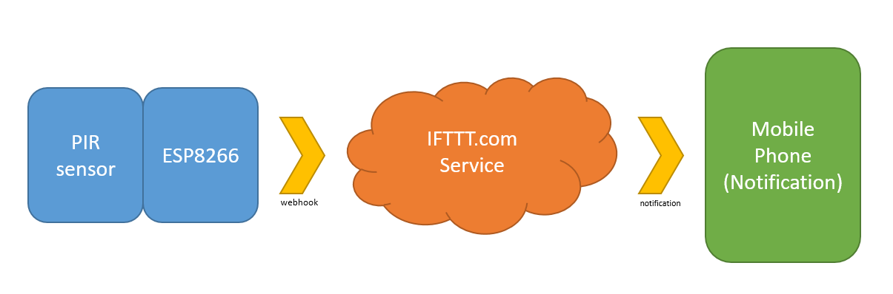

# Intruder Alert

This is an updated version of our Intruder Alert project; designed to be both easier to manage and more secure.

The ideas don't just stop at a PIR sensor either; The code is very simple to understand and through the IFTTT service you can cause anything to trigger; such as using a button or light sensor.

## Table of Contents

- [Intruder Alert](#Intruder-Alert)
  - [Table of Contents](#Table-of-Contents)
  - [Bill of Materials](#Bill-of-Materials)
  - [System Overview](#System-Overview)
  - [Soldering prototyping shield](#Soldering-prototyping-shield)

## Bill of Materials

| Qty | Code                                    | Description                |
| --- | --------------------------------------- | -------------------------- |
| 1   | [XC3802](http://jaycar.com.au/p/XC3802) | ESP8266 module             |
| 1   | [XC3850](http://jaycar.com.au/p/XC3850) | prototyping shield for ESP |
| 1   | [XC4444](http://jaycar.com.au/p/XC4444) | PIR motion sensor          |
| 1   | [ZD0230](http://jaycar.com.au/p/ZD0230) | Red LED                    |
| 1   | [ZD0232](http://jaycar.com.au/p/ZD0232) | Green LED                  |
| 1   | [SP0601](http://jaycar.com.au/p/SP0601) | PCB mounted switch         |

- The off-cuts of the LEDs are used to bridge connections on the PCB board. If you want you can include {WH3032} to have plenty of spare solid core wire around.

## System Overview

Instead of talking directly to the `gmail` service as our old Intruder alert did, we now communicate through <https://IFTTT.com>. We simply connect a `webhook` that the ESP can activate, which causes `IFTTT` to send a notification to our phone (requiring the `IFTTT` app installed on your phone).

This is a simple case, but through IFTTT you can connect it to many different applications; IFTTT has support for apps such as GMail, Spotify, Google docs, Facebook, Twitter, and many others.

## Soldering prototyping shield

The connections are fairly simple on this board; as the LEDs are powered straight from the GPIO pin (being 3v, it's low enough not to cook the LED), as well as the button to ground, and the signal from the PIR sensor.

| ESP8266 Pin | Connects through | Towards |
| ----------- | ---------------- | ------- |
| D0          | Green LED        | Ground  |
| D6          | Red LED          | Ground  |
| D8          | Button           | Ground  |
| D7          | PIR (middle pin) | -       |

The view of the top side of the board is shown below. It is **important** to get the orientation correct, so make sure the pin in the top left is `TX` when looking at the top, and the bottom-rightmost pin is `3v3`.

The bottom-side of the board is reversed, obviously. A good idea might be to place the components in and bend the leads so that they stay in place while you turn it over to solder.