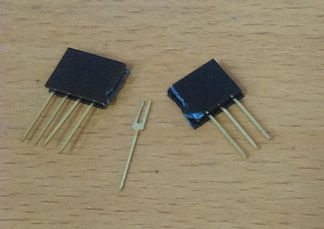
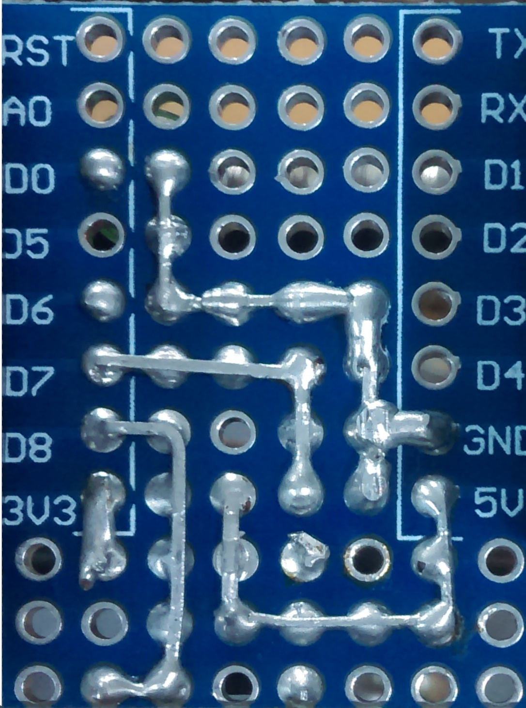
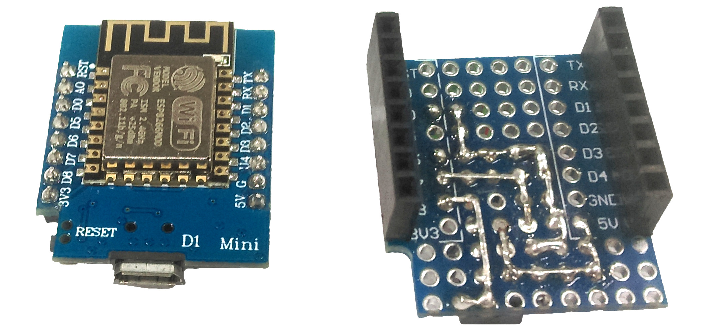
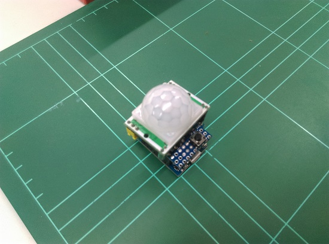

# Intruder Alert

This is an updated version of our Intruder Alert project; designed to be both easier to manage and more secure.

The ideas don't just stop at a PIR sensor either; The code is very simple to understand and through the IFTTT service you can cause anything to trigger; such as using a button or light sensor.

## Table of Contents

- [Intruder Alert](#Intruder-Alert)
  - [Table of Contents](#Table-of-Contents)
  - [Bill of Materials](#Bill-of-Materials)
  - [System Overview](#System-Overview)
  - [Soldering prototyping shield](#Soldering-prototyping-shield)
  - [Programming and Source code](#Programming-and-Source-code)
    - [Setting up IFTTT applet](#Setting-up-IFTTT-applet)
      - [Getting the Webhook Key](#Getting-the-Webhook-Key)
    - [Adding the URL to the source code](#Adding-the-URL-to-the-source-code)
  - [Use](#Use)
  - [Explore the project](#Explore-the-project)
    - [Troubleshooting](#Troubleshooting)
    - [Further Reading](#Further-Reading)

## Bill of Materials

| Qty | Code                                    | Description                |
| --- | --------------------------------------- | -------------------------- |
| 1   | [XC3802](http://jaycar.com.au/p/XC3802) | ESP8266 module             |
| 1   | [XC3850](http://jaycar.com.au/p/XC3850) | prototyping shield for ESP |
| 1   | [XC4444](http://jaycar.com.au/p/XC4444) | PIR motion sensor          |
| 1   | [ZD0230](http://jaycar.com.au/p/ZD0230) | Red LED                    |
| 1   | [ZD0232](http://jaycar.com.au/p/ZD0232) | Green LED                  |
| 1   | [SP0601](http://jaycar.com.au/p/SP0601) | PCB mounted switch         |

- The off-cuts of the LEDs are used to bridge connections on the PCB board. If you want you can include [WH3032](https://jaycar.com.au/p/WH3032) to have plenty of spare solid core wire around.

## System Overview


Instead of talking directly to the `gmail` service as our old Intruder alert did, we now communicate through <https://IFTTT.com>. We simply connect a `webhook` that the ESP can activate, which causes `IFTTT` to send a notification to our phone (requiring the `IFTTT` app installed on your phone).

This is a simple case, but through IFTTT you can connect it to many different applications; IFTTT has support for apps such as GMail, Spotify, Google docs, Facebook, Twitter, and many others.

## Soldering prototyping shield

The connections are fairly simple on this board; as the LEDs are powered straight from the GPIO pin (being 3v, it's low enough not to cook the LED), as well as the button to ground, and the signal from the PIR sensor.

| ESP8266 Pin      | Connects through | Towards |
| ---------------- | ---------------- | ------- |
| D0               | Green LED        | Ground  |
| D6               | Red LED          | Ground  |
| D8 (pulled-down) | Button           | 3v3     |
| D7               | PIR (middle pin) | -       |

Use a spare extension header ( female header with long legs) to connect the PIR sensor to the board, by splitting off a section of 3 from it. You can use a sharp knife to trim away the edge and make it more neat in appearance.



The view of the top side of the board is shown below. It is **important** to get the orientation correct, so make sure the pin in the top left is `TX` when looking at the top, and the bottom-rightmost pin is `3v3`.


The bottom-side of the board is reversed when you flip it over. A good idea might be to place the components in and bend the leads so that they stay in place while you turn it over to solder.



Be sure to get the LED's in the correct orientation as well. The longer lead on the LED is the positive, which goes into the `D0`/`D6` holes. The negative side (has a flat edge on the globe of the LED) faces towards the middle of the PCB board.


It will be easier to do the solder of the components before you put on the two headers. Because we might want to use the ESP8266 in later breadboard designs, we are putting the male connectors on the ESP8266 (facing downwards) and the female connectors on our prototyping shield.



It bears repeating that the pins must match up, so check that the orientation is correct, you can then put the two halves together, and put the PIR sensor on the shield as shown below.



This has the metal part of the [XC3802](https://jaycar.com.au/p/XC3802) facing downwards, and the PIR on top.

## Programming and Source code

There's 3 bits of information you need to place in the `intruder.ino` source code:

- WiFi SSID
- WiFi Password
- IFTTT URL

You can put in the WiFi SSID (the name of the network) and the password as normal; then for the IFTTT url, head to <https://ifttt.com> and create an account or log in.

### Setting up IFTTT applet


Firstly, we have to connect 2 services to our account, then bind them together. the IFTTT page seems to change often so screenshots won't help, however the idea is the same:

Once you have logged into your account:

- Explore or Search for "Webhooks" service, and connect your account to that.
- Explore or Search for "Notifications" service, and connect your account to that as well.

Then in the top right, click your avatar to bring the drop-down menu, and press "create". You should come to a large screen that says "If +This Then That"


- Click on the `+This`, search for webhook.
- "Receive a Web Request"
- Event name: "`motion`"
- Create Trigger


Now you should be back at large writing;

- Click on the `+That`, search for notifications
- "Send a notification from the IFTTT app"
- Put your own custom message if you want to.
- Create Action


Now you should be on the review screen which will show you what the total process will look like. Click Finish once you are satisfied.


#### Getting the Webhook Key

You will need the webhook key in order to activate it. Head to the webhook settings here: <https://ifttt.com/maker_webhooks/settings> and find the URL.

You can notice the last portion of your maker URL, after the `/use/` will be the key. For instance, if your maker URL is:

```plaintext
https://maker.ifttt.com/use/bhPYcN-gOSLrYLGWg4r8Lf
```

Then your maker key is `bhPYcN-gOSLrYLGWg4r8Lf`.

### Adding the URL to the source code

Edit the source code and change the `EVENT_NAME` to be the event name you set while setting up the connection, which was "motion" in our example. Then change the `MAKER_KEY` to be your Maker Key above.

Finally, your `ifttt_url` should look something like this, replacing `motion` with your event name, and containing your key.

```cpp
const char *ifttt_url = "https://maker.ifttt.com/trigger/motion/with/key/Rg3Pj8f_-qyJTcT1YhhVb";
```

## Use

Use the `IFTTT` app to get notifications on your phone. When the ESP8266 is first powered up, you should see the red light blinking at a moderate pace. This is in a **disarmed** state.

When it detects motion, the green light will flash twice. You can use this to test when motion is detected.

When it is ready, you can hold the button down for 1-2 seconds. All lights should go off, with the red then flashing 3 times, before staying on for 3 seconds.

This signifies that the ESP8266 has been armed. if everything has been set up correctly it will now alert your phone when it detects motion.

## Explore the project

This project is fairly simple to understand, as it simply checks the PIR sensor to see if it has detected movement and then fetches a website.

This could be connected from and to anything. The great power of IFTTT makes it versatile while still being simple to understand and use. You can also send data to the ifttt service using arduinoJSON and POST requests, which we have done in one of our data-logger projects.

One issue with the project is that it won't always pick up motion due to how the LED's are blinking. This is on purpose as it makes the code easier to understand, but if you wanted to do it properly, you would get rid of all the delays and use `millis()` instead. - this can complicate the code quite a bit but we can explore this in github branch for the project. You're welcome to submit your attempts and we can help out.

### Troubleshooting

If you are having issues with it always detecting motion, or not detecting motion, try a simple sketch (such as:)

```cpp
void loop(){
  digitalWrite(led_green, digitalRead(pir_sense));
  delay(100);
}
```

Adjust the potentiometers so that you can get the sensitivity right for where you want to use it, This could take some trial and error to find the sweet spot.


The PIR sensor will not do good looking at sunlight, as sunlight contains IR, which will move throughout the day (as the shadows / sunlight is moving across the ground).

If you have issues sending notifications, open up the Serial Monitor and see what the information says. It should say "congratulations" -- if it does, make sure your ifttt connection is set to the same event name, and that you have the IFTTT app installed on your phone.

### Further Reading

- How PIR's work <https://learn.adafruit.com/pir-passive-infrared-proximity-motion-sensor/how-pirs-work>
- Explore IFTTT Services: <https://ifttt.com/discover>
